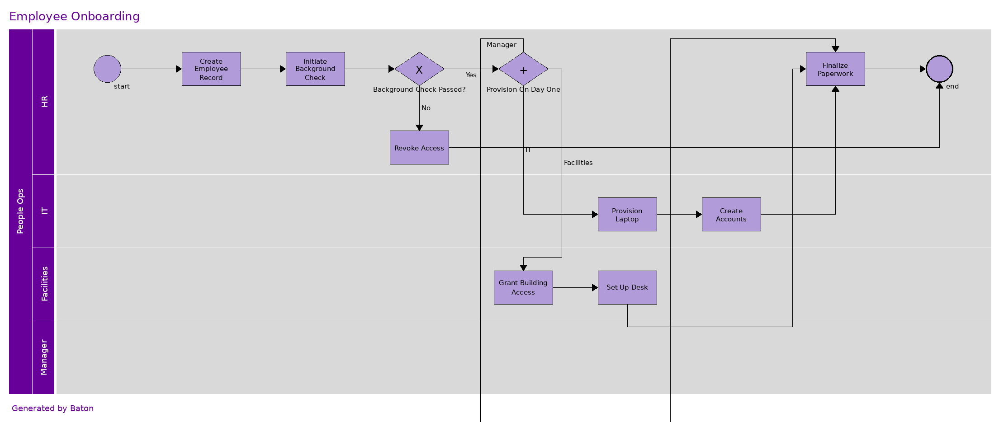
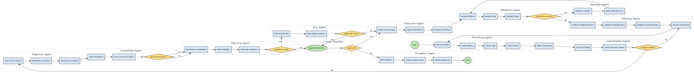

# Baton

[](https://github.com/adrianpuiu/Baton/actions/workflows/ci.yml)

> **Business processes that run themselves.**
>
> Describe a process in plain English → a **BPMN diagram**, an **enterprise BPMN XML file**, *and* a **live multi-agent workflow** that runs it. One PiperFlow DSL, three consumers. Self-hosted model — no per-token cost, no vendor lock-in, no data egress.
>
> _A business-process diagram is already an execution spec — swimlanes are roles, tasks are steps, gateways are decisions. Baton is the compiler that turns the spec into a running system, and draws the BPMN for free._



---

## Why we built this

This started with a simple observation and a professional frustration.

 A "business process diagram" is already an execution specification. Its swimlanes are roles, its tasks are steps, its gateways are decisions, its connections are control flow. The only reason a BPMN diagram isn't *running code* is that nobody compiled it. Most tools that turn English into a process picture treat the picture as the end. It isn't — it's a spec waiting for a compiler.

**The bridge.** So this project compiles one. A plain-English description becomes a tiny text format (**PiperFlow**), and that one document is consumed three ways — a stakeholder diagram, an enterprise BPMN XML file, and a live multi-agent program. It connects two worlds I'd lived between: the **BPMN world** stakeholders and BPM suites live in (Camunda, Signavio, Appian), and the **modern agentic world** (Flue, multi-agent systems). Few people speak both fluently; that's the gap this fills.

**The platform-engineering stance.** Every choice here is deliberate platform engineering, not "just make it work":

- **One schema, many consumers** — the golden-path pattern: a single source of truth that renders, exports, *and* executes.
- **Wrap painful tools with real engineering** — `processpiper` renders the picture; when its layout engine throws on a large process, we fall back to a structural diagram instead of crashing. *Valid input should never die.*
- **Recover, don't fail** — model output is imperfect, so generation self-heals: a defect is caught, fed back to the model, and regenerated.
- **Observability is a first-class citizen** — every lane is a named session, every step is a span, every gateway decision is an event. The process is queryable in Grafana, not just drawable.
- **Self-hosted by default** — it runs on a local model. No per-token cost, no vendor lock-in, no data leaving the box.

**Why it matters.** turning ambiguous requirements into a reliable, observable, self-correcting system that wraps existing tools rather than reinventing them. It's also, deliberately, a bridge back to the BPM world — because the best automation doesn't replace what people use, it makes what they already have actually *run*.

---

## What it does

```
natural language
      │  (vLLM agent authors PiperFlow DSL — the single source of truth)
      ▼
 PiperFlow DSL ──► parse() ──► ProcessAST
                      ├──► renderDiagram()      → PNG / SVG (+ Graphviz fallback)
                      ├──► renderDiagram(bpmn)  → BPMN 2.0 XML (Camunda / Signavio / etc..)
                      ├──► emitFlueWorkflow()   → src/workflows/gen-<name>.ts  (runnable)
                      └──► executeProcess()     → live trace (one agent per swimlane)
```

**Plain English is the *generation* input; you never write PiperFlow or TypeScript by hand.**
Describe a process; get back a diagram, an enterprise BPMN file, a compiled Flue workflow, and a live execution trace where each gateway branches on a real decision.

## Showcase processes

Two built-in processes demonstrate the system at different scales:

| Process | Why it's here | Run |
|---|---|---|
| **Employee Onboarding** (`src/samples/onboarding.pf`) | The one process every interviewer recognises. Showcases a **parallel gateway** (day-one provisioning fans out to IT + Facilities + Manager) and an exclusive **background-check gate**, with real provisioning tools that write a persistent HRIS-style audit trail. | `npm run onboard:demo` |
| **Autonomous Self-Healing AIOps** (`src/samples/aiops-self-healing.pf`) | The technical showpiece: 5 pools, 12 lanes, 6 gateways, a human-approval step (`@message`), a rollback loop, and a continuous-monitoring cycle. Stresses every compiler feature. | `npm run aiops:build` |

The onboarding run leaves a real artifact — `employees/EMP-*.json` — a timestamped audit trail of every provisioning action across lanes, exactly what an HRIS produces.



---

## Quick start

### 60-second happy path — no model, no GPU, no Docker

Clone, install, and watch a four-lane onboarding process execute end-to-end.
This is the deterministic half of Baton (everything except the LLM): it drives
the real per-lane provisioning tools, fans out across HR → IT → Facilities →
Manager, and leaves a genuine `employees/EMP-*.json` audit trail behind —
exactly what an HRIS produces.

```bash
git clone https://github.com/adrianpuiu/Baton && cd Baton
npm install
npm run onboard:demo
```

```text
HR: created EMP-MQJDGRR6
HR: background check passed
— day-one provisioning fan-out —
IT: laptop + accounts provisioned
Facilities: badge + desk assigned
Manager: orientation + buddy assigned
HR: paperwork finalized → employee active

=== audit trail: EMP-MQJDGRR6 (Jane Smith) — status: active ===
  2026-06-18T10:43:45.666Z  record_created         [HR]
  2026-06-18T10:43:45.672Z  background_check       [HR]
  2026-06-18T10:43:45.673Z  laptop_provisioned     [IT]
  2026-06-18T10:43:45.674Z  accounts_created       [IT]
  2026-06-18T10:43:45.674Z  badge_issued           [Facilities]
  2026-06-18T10:43:45.674Z  desk_assigned          [Facilities]
  2026-06-18T10:43:45.675Z  orientation_scheduled  [Manager]
  2026-06-18T10:43:45.675Z  buddy_assigned         [Manager]
  2026-06-18T10:43:45.675Z  paperwork_finalized    [HR]
```

The audit trail lands in `employees/EMP-*.json` — open it and you'll see every
provisioning action timestamped and attributed to its lane.

Want to see the contract holds? The suite that mirrors CI runs with no infra:

```bash
npm test            # node:test — parser, emitter, parse-error contract, rendering
```

You don't even need to render anything to see the BPMN output — the showcase
diagrams are committed: [`diagrams/onboarding.png`](diagrams/onboarding.png)
(the process you just ran) and
[`diagrams/aiops-self-healing-structural.png`](diagrams/aiops-self-healing-structural.png).

### Or run it in a container (zero local setup)

Prefer not to install Node + Python + Graphviz locally? The image bundles all
three toolchains, so the *full* path — including diagram rendering and the
Graphviz fallback — runs anywhere Docker does:

```bash
docker build -t baton .
docker run --rm baton              # the onboarding demo (default CMD)
```

To drive the model-in-the-loop path against a vLLM server on your host, point
the container at it and run the design workflow:

```bash
docker run --rm \
  -e VLLM_BASE_URL=http://host.docker.internal:8000/v1 \
  baton npm run run:design -- --payload '{"prompt":"..."}'
```

`Dockerfile` follows the usual layer-hygiene: deps are copied before source so
`npm install` is cached across builds; it runs as the non-root `node` user; and
the Python renderer lives in an isolated venv (`/opt/venv`, exposed via `$PYTHON`)
so it never pollutes the Debian system site-packages. The bulk of the image is
Flue's Cloudflare `workerd` runtime (pulled transitively); Node + Python +
Graphviz together are a small fraction.

### Full AI path — generate processes from plain English (optional)

The happy path above is deterministic. To have Baton **write** a process from a
plain-English description — producing the PiperFlow DSL, a diagram, BPMN XML, a
compiled Flue workflow, and a live execution trace — point it at a self-hosted
model. That needs two extra things:

**1. A renderer for fresh diagrams** (only needed to draw *new* diagrams — the
committed ones above need nothing):

```bash
python3 -m venv .venv && . .venv/bin/activate
pip install processpiper          # + graphviz on PATH for the structural fallback
cp .env.example .env
```

**2. A local model on `http://localhost:8000/v1`** (OpenAI-compatible; e.g.
vLLM). Then:

```bash
npm run run:design -- --payload '{"prompt":"A team merges a PR; CI runs tests, then builds. If tests fail the devs are notified. After building, in parallel security scans it and ops deploys to staging; finally a release is published."}'
```

Every `design-process` run also writes a **runnable** Flue workflow flat into
`src/workflows/gen-<slug>.ts`. Run it:

```bash
npx flue run gen-<slug> --target node
```

It's idiomatic Flue: each swimlane is a `defineAgentProfile` sub-agent on a
coordinator; steps delegate via `session.task(label, { agent })`; exclusive
gateways branch on a `yes/no` result; parallel gateways fan out (emitted
sequentially — Flue sessions are single-operation; see the design notes).

> **aarch64/Linux note:** Flue's CLI pulls in Cloudflare's `workerd`, whose
> `linux-arm64` binary doesn't always auto-install. If `npx flue` errors on
> workerd, run `npm install --no-save @cloudflare/workerd-linux-arm64`.

---

## Resilience — recover, don't fail

Two failure modes that used to crash the pipeline are now handled gracefully. Both
came directly from observing real runs (the observability layer earned its keep):

- **Self-healing generation** — the model's first DSL is occasionally imperfect
  (an orphan element, a dangling reference, an inverted gateway). `design-process`
  catches the precise validation error, feeds it back, and regenerates — up to 3
  attempts. *Observed in practice:* a vague prompt ("self healing agent harness")
  failed on attempt 1 and succeeded on attempt 2.
- **Graceful-degradation rendering** — `processpiper`'s grid-layout engine has
  known limits on large interconnected processes (it throws `KeyError`). When it
  does, `renderDiagram` falls back to a faithful Graphviz structural rendering of
  the same AST (lanes as clusters, gateways as diamonds). *A valid process never
  fails to produce a diagram.*
- **Direct AST→BPMN emitter** — processpiper's BPMN export runs inside the same
  `draw()` call that fails, so a large process would silently *lose* its BPMN —
  breaking the three-consumer contract exactly on the showcase processes that
  need it. `emitBpmn()` turns the AST into valid OMG BPMN 2.0 XML directly (process,
  lanes, every node type, sequence flows, a deterministic grid DI), with no
  dependency on any layout engine. It runs on the fallback path, so **a valid
  process never fails to produce BPMN either** — diagram *and* XML are guaranteed.
- **The data layer (Executable conformance)** — PiperFlow can declare a data layer
  (`data: order : Order`) and per-task I/O (`[Validate] as v { in: order; out: validated_order }`).
  The emitter then produces full Executable-conformance BPMN: `itemDefinition`s,
  `dataObject`s, per-activity `ioSpecification` (inputSet/outputSet), and
  `dataInputAssociation`/`dataOutputAssociation` — and marks the process
  `isExecutable="true"`. This is the line between a diagram that *runs* and one
  that *executes* with real data flow, and it's the seed of a runtime evaluator
  that self-assembles behaviour against process variables.
- **Gateway-semantics detection** — if a generated exclusive gateway looks
  inverted (e.g. a recovery step on the "no" branch), the compiler emits a visible
  `⚠` comment **and** a runtime `log.warn`, so the defect surfaces in code and in
  telemetry before it ships.

---

## Capabilities — tools & skills per lane

A swimlane is more than a role; it's a role **with the means to do its work**. There
are three sources of capability, forming an **acquire → synthesize → wire** triangle:

### 1. Local tools (deterministic, offline, always available)

Flue `defineTool` actions bound to lanes by role in `capabilitiesFor()`:

| Lane name pattern | Gets |
|---|---|
| `CI` / `test` / `build` / `pipeline` | `run_tests`, `build_artifact` tools |
| `deploy` / `ops` / `release` / `sre` | `deploy_to_staging` tool |
| `security` / `vuln` | `security-scan` skill |

`run_tests` actually shells into a repo and reports pass/fail — so a `[Run Test
Suite]` task in a CI lane causes the agent to **call** the tool and branch on the
real result, not guess. Point `SAMPLE_REPO` at your own repo to run it against real
code.

### 2. Open-ecosystem discovery (find-skills → skills.sh)

Lanes pull expertise from the open agent-skills ecosystem:

```bash
npm run resolve:skills     # per-lane skills.sh search → skills.manifest.json (reviewable, quality-gated)
npm run lock:skills        # npx skills add → .agents/skills/ + skills.wiring.json (compat-checked)
```

Discovery is online **once, at build time**; the locked skills run fully offline.
Quality gate: `installs ≥ SKILLS_MIN_INSTALLS` (default 500) + known-source boost.

### 3. Synthesis for gaps (skill-creator)

Some lanes are too niche for the ecosystem (e.g. *Diagnosis Agent*, *Recovery
Agent*). Instead of degrading to plain prompting, `generate-skills` synthesizes one:

```bash
npx skills add anthropics/skills --skill skill-creator   # one-time install
npm run generate:skills    # synthesize a SKILL.md per gap lane → wiring
```

Guided by `skill-creator`'s methodology, constrained to a strict `name`+`description`
frontmatter contract, and compat-gated before install — so a generated skill can
never break Flue's build the way some community skills (nested `metadata:`) do.

The codegen wires **discovered + synthesized** skills onto lane profiles
automatically.

---

## Observability

Every lane is a named session and every step is an observable operation. Flue's
`observe(...)` stream is consumed **two ways**, so the self-hosted ethos holds:

1. **Local JSONL sink** (zero infra, always on) — every event appends to
   `telemetry/events.jsonl`. Read it with no collector:
   ```bash
   npm run metrics                    # dashboard summary in the terminal
   curl localhost:3000/metrics        # same data as JSON
   ```
2. **OpenTelemetry → Grafana** (opt-in headline path) — set
   `OTEL_EXPORTER_OTLP_ENDPOINT` and the OTel adapter exports spans
   (`flue.workflow`, `flue.operation`, `chat <model>`, `flue.tool`, `flue.task`):
   ```bash
   docker compose up -d                        # Grafana :3001 + Tempo :4318
   OTEL_EXPORTER_OTLP_ENDPOINT=http://localhost:4318 npx flue run gen-<slug> --target node
   ```
   The provisioned dashboard shows run pass/fail, operations per swimlane,
   model-turn latency by lane, slow/failing operations, and Flue logs (gateway
   yes/no decisions).

Gateway branch rates come from the executor, which emits structured
`ctx.log('gateway decision', { lane, label, decision })` events. Per the Flue
observability docs, token/cost totals sum `turn` leaf values (not operation
roll-ups) and nested durations aren't summed.

---

## Architecture

| File | Role |
|------|------|
| `src/app.ts` | Registers the `vllm` provider; registers the telemetry observer; mounts Flue's routes + `/metrics`. |
| `src/workflows/design-process.ts` | Orchestrator: NL → DSL → diagram + BPMN + workflow + execution, with self-healing retry. |
| `src/workflows/generate-skills.ts` | Synthesizes a Flue skill for each lane discovery left empty. |
| `src/compiler/parse.ts` | PiperFlow → validated `ProcessAST`. Full grammar; orphan/dangling-ref detection. |
| `src/compiler/emit.ts` | AST → runnable Flue workflow (codegen). Exclusive→`if/else`, parallel→`Promise.all`, gateway-inversion detection. |
| `src/compiler/execute.ts` | AST → live execution, one named session per lane, branching/fan-out. |
| `src/compiler/dsl-spec.ts` | The grammar given to the model (the DSL *is* the output contract). |
| `src/actions/render.ts` | DSL → PNG/SVG/BPMN via `processpiper`, with Graphviz fallback. |
| `src/capabilities/registry.ts` | Binds local tools/skills to lanes by role. |
| `src/capabilities/skill-resolver.ts` | Resolves + quality-gates open-ecosystem skills. |
| `src/observability/` | Local JSONL sink + metrics aggregator + opt-in `@flue/opentelemetry` export. |
| `scripts/render.py` | Python wrapper around `processpiper.text2diagram.render`. |

Engineering trade-offs are documented in [`docs/DESIGN-DECISIONS.md`](docs/DESIGN-DECISIONS.md).

## Wiring the local vLLM model

vLLM exposes an OpenAI-compatible API. Flue supports any such endpoint via
`registerProvider` in `src/app.ts`:

```ts
registerProvider('vllm', {
  api: 'openai-completions',
  baseUrl: 'http://localhost:8000/v1',
  apiKey: 'vllm',            // vLLM ignores it; the client needs non-empty
});
```

Models are referenced as `vllm/<model-id>` (e.g. `vllm/Capybara`).

> **Thinking models.** The served model (Qwen3.6) is a hybrid thinking model: it
> emits reasoning tokens before its answer. That's fine for DSL authoring (it
> improves quality) given a generous token budget. For clean, fast, non-thinking
> output, restart vLLM with thinking disabled in the chat template, or call the
> endpoint with `chat_template_kwargs: { enable_thinking: false }`.

## Scope / roadmap

A working system, live-tested against a local vLLM model. Honest status:

- [x] **Parse** — full ProcessPiper grammar (events, subprocess, all four gateway types, connection sides, chained edges).
- [x] **Render** — PNG/SVG via processpiper, with Graphviz structural fallback.
- [x] **BPMN export** — OMG-standard BPMN 2.0 XML (Camunda/Signavio/Appian).
- [x] **Compile** — AST → readable, runnable Flue workflow; exclusive/parallel/inclusive semantics.
- [x] **Execute** — runtime walker, one named session per lane, live branching and fan-out.
- [x] **Resilience** — self-healing generation, graceful-degradation rendering, gateway-inversion detection.
- [x] **Capabilities** — local tools + open-ecosystem discovery + skill synthesis (acquire → synthesize → wire).
- [x] **Observability** — local JSONL sink + `/metrics` (zero infra) AND opt-in OTel → Grafana/Tempo + provisioned dashboard.
- [ ] **Formal fork-join** — parallel branches rejoin via a shared `visited` set; true BPMN synchronising-merge (dominator analysis) is the next compiler step.
- [ ] **Direct AST→BPMN emitter** — large processes that hit processpiper's layout limit lose their BPMN file; a direct emitter would preserve enterprise interchange for any size.
- [ ] **HTTP surface** — expose `design-process` behind `route` so stakeholders POST a description and get everything back.
- [ ] **Fully agentic variant** — let the orchestrator choose tools via Flue tool-calling instead of the current procedural flow.

## Development

The compiler and renderer are covered by real assertions (`node:test`) and run on every push via CI:

```bash
npm run typecheck   # tsc --noEmit
npm run lint        # eslint + typescript-eslint (recommended)
npm test            # node:test — parser, emitter, parse-error contract, rendering
```

The render test degrades to the Graphviz structural fallback when processpiper isn't installed, so it runs anywhere Graphviz is present (including CI) and skips cleanly otherwise.

## License

MIT.
